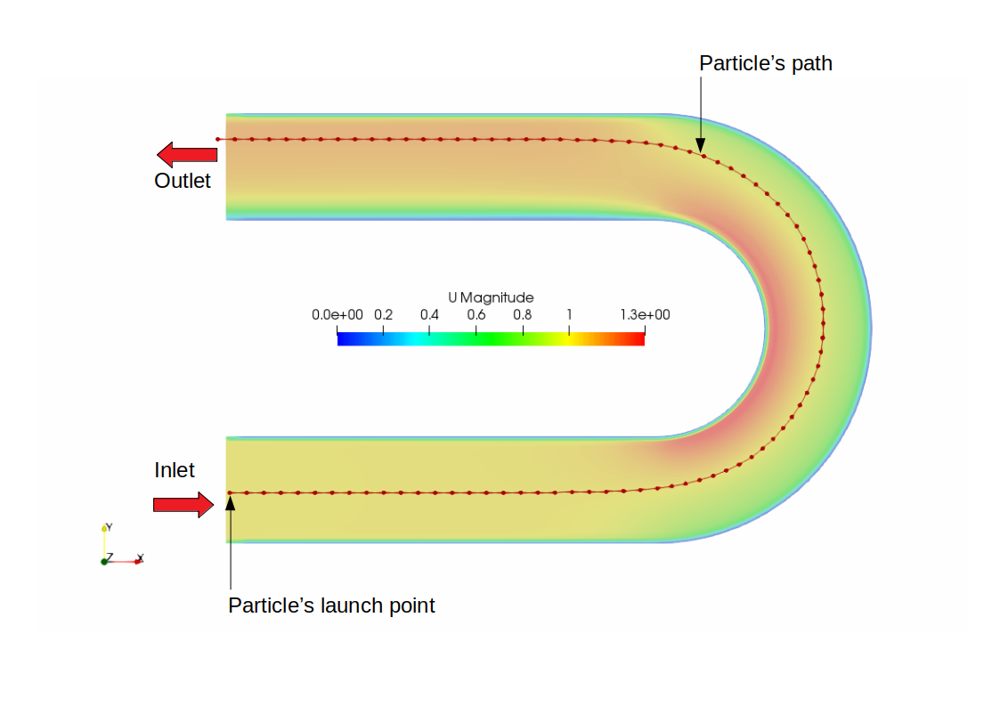

# OFtutorial-16 Massless particle tracking
in this tutorial, an custom application for massless particle tracking on an already solved flow field
will be developed. This tutorial introduces following concepts.

* setting simulation time to read data at particular saved timestep.
* datatypes *point* and *pointList*, which are nothing but vector datatypes dedicated to coordinates.
* a mesh function to get the id of a cell within which a given point coordinates recides.
* Lagrangian massless particle tracking.
* writing VTK file for visualizing the particle's track.

following is an enhanced output from the testCase included in this tutorial

all the comments on code is given in the OFtutorial16.C file itself. And the distance
travelled by the particle and time it took will be printed at the end of computation on
the terminal.

Note: the VTK file of particle path has to be manually opened in ParaView or paraFoam
after loading the simulation case results. the vtk file will be created and placed
inside VTK/ folder under testCase/ directory.

